# Wiring up observability with the `observent` skill

A screenshot walkthrough of instrumenting this repo's four A2A services (admin
router + `text2sql` on CrewAI, `rag` on LangGraph, `deepresearch` on Google ADK)
with the `observent` Claude Code skill, from invocation to verified traces.

## 1. Invoke the skill

Asking Claude to add observability to `real_a2a/` is enough for it to recognize
the `observent` skill as the right tool and load it.

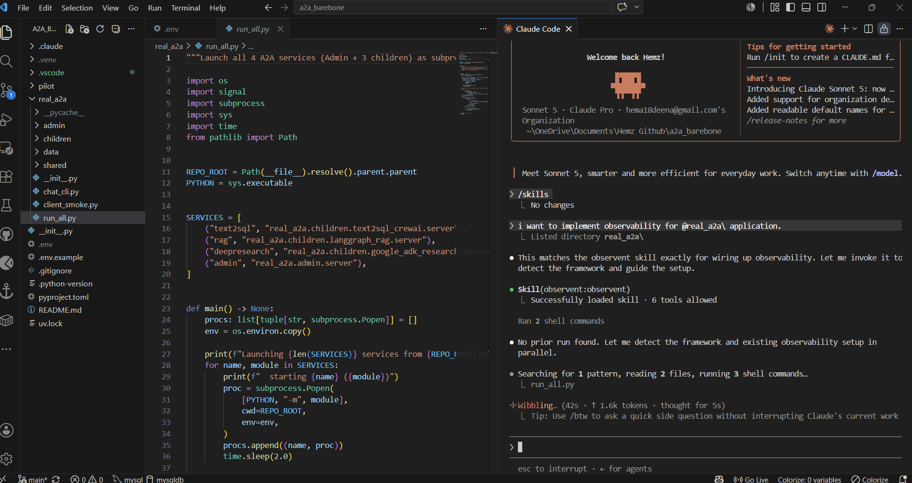

## 2. Detection + backend choice

`observent` first detects the frameworks in play — here it correctly found all
three (CrewAI, LangGraph, Google ADK) spread across four independent
processes — then asks which backend(s) to fan traces out to before writing a
spec.

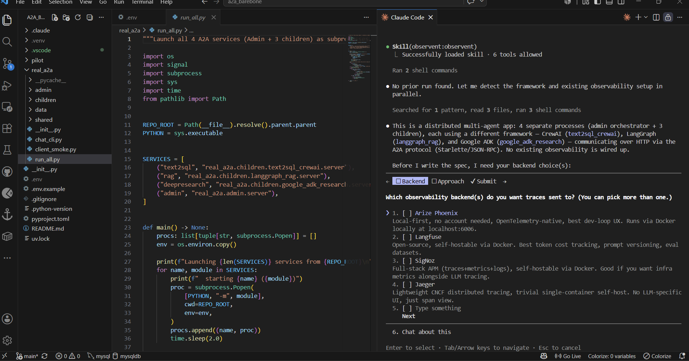

## 3. Local backend provisioning

Once a backend is picked, the skill checks whether it's reachable and offers
to provision it locally via Docker Compose if not.

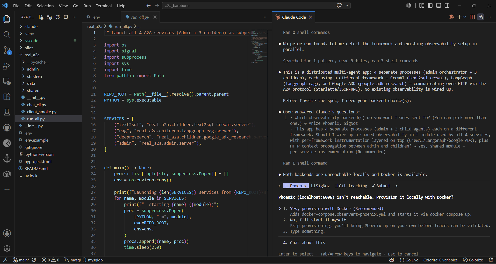

An early pass through this flow evaluated **SigNoz** as a self-hosted backend
alongside Phoenix — provisioning brought up its full container stack
(ClickHouse, Postgres metastore, otel-collector, query service) automatically:

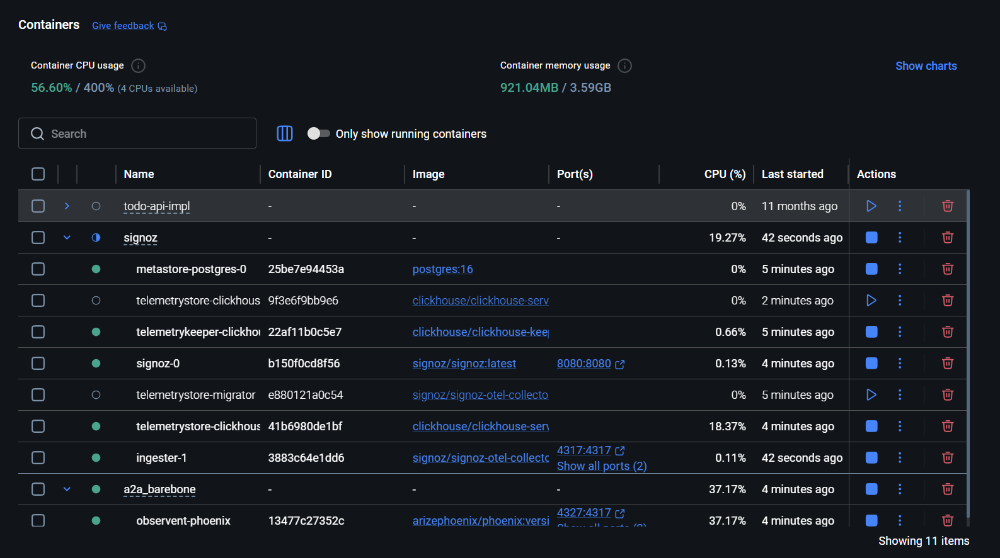

The skill generates a spec/plan pair before touching any code — new files,
edited files, and the exact dependency install command are all listed for
review before anything is applied:

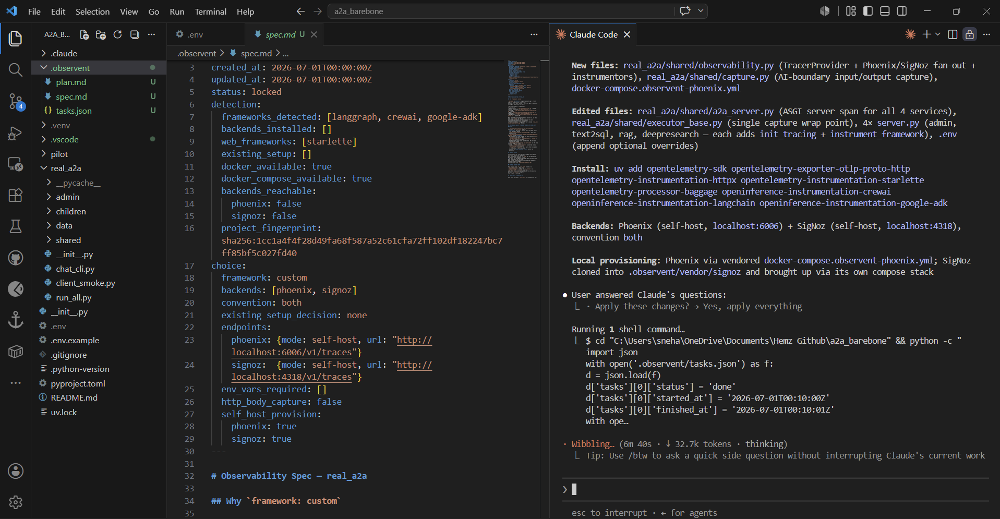

With traces flowing, SigNoz's Traces Explorer shows the expected shape: root
spans per service (`text2sql`, `admin`) with full span counts and durations.

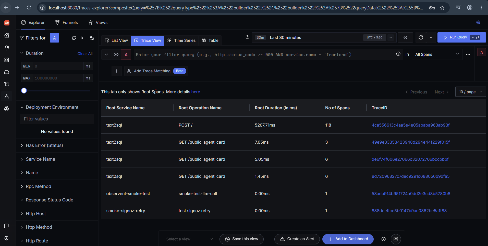

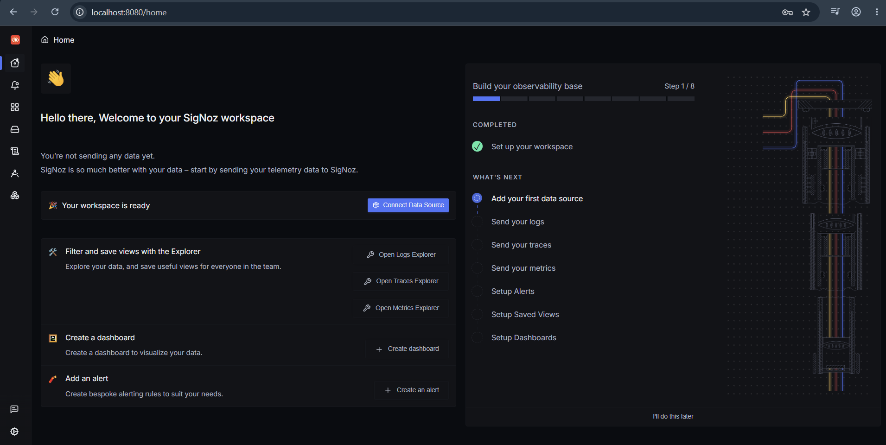

## 4. The shipped setup: Phoenix + Langfuse

The instrumentation that actually ships in this repo (see [`README.md`
§ Observability](README.md#observability)) fans every span out to two
backends at once — **Arize Phoenix** and **Langfuse** — so both a fast local
dev loop and cost/token-focused analysis are available without picking one.

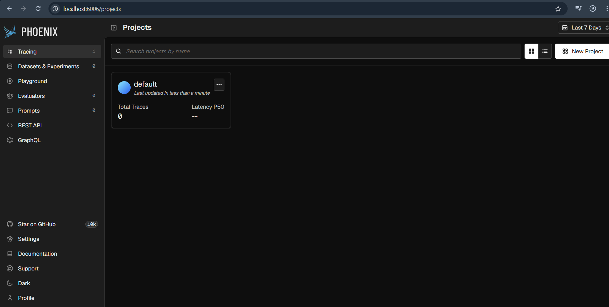
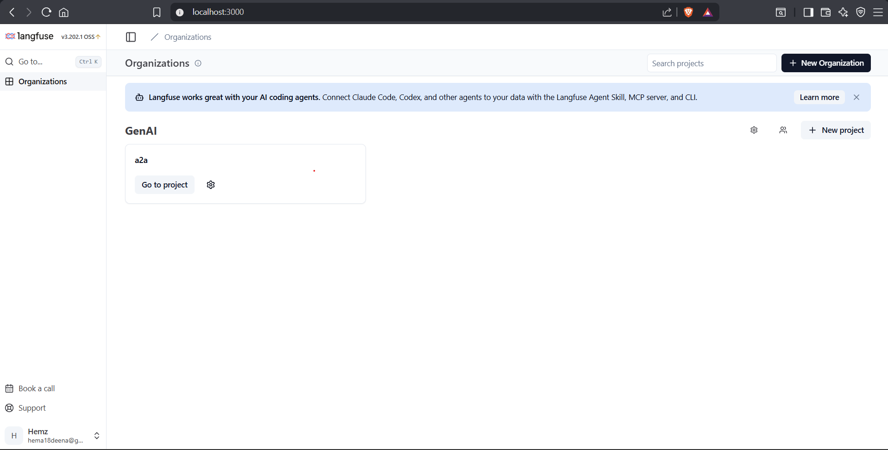

## 5. Verifying real traces, side by side

The proof that dual-export actually works: the same request produces the same
trace ID in both backends. Each service below shows its `admin.run` →
`crew.kickoff` / framework-run → LLM-call span hierarchy, with full
input/output capture, token counts, and per-span latency — captured once in
`real_a2a/shared/observent_capture.py` and mirrored to both UIs.

**`text2sql` (CrewAI)** — natural-language question routed to a SQL-writing
crew, query executed against SQLite, results returned:

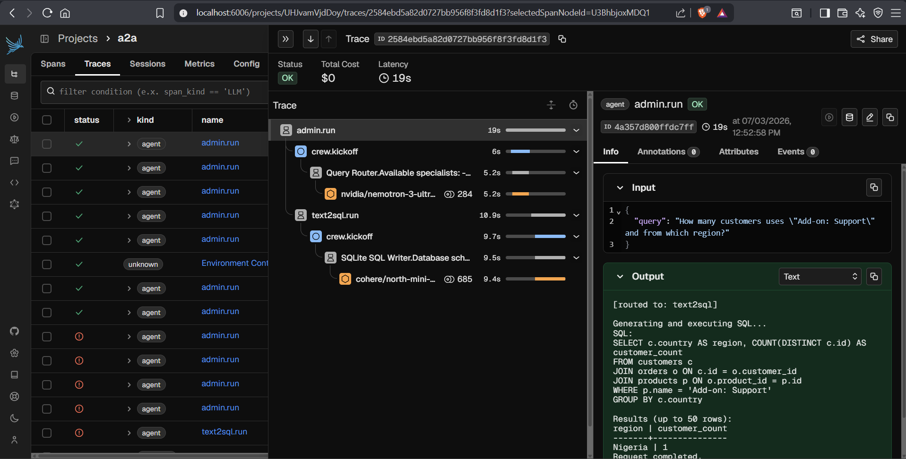
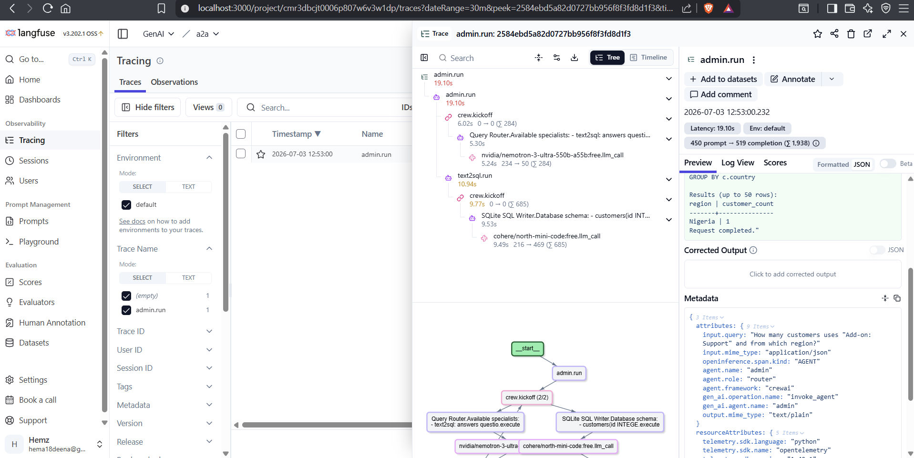

**`rag` (LangGraph)** — retrieve → generate graph answering from the product
manual:

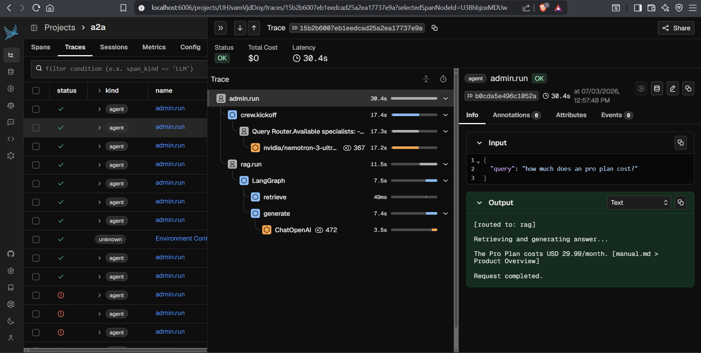
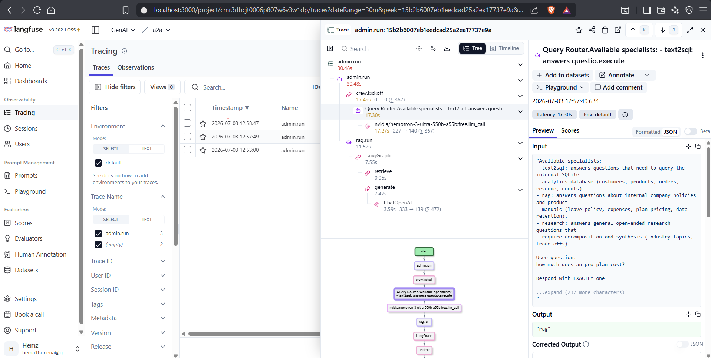

**`deepresearch` (Google ADK)** — multi-step research agent decomposing a
question into sub-questions before synthesizing an answer:

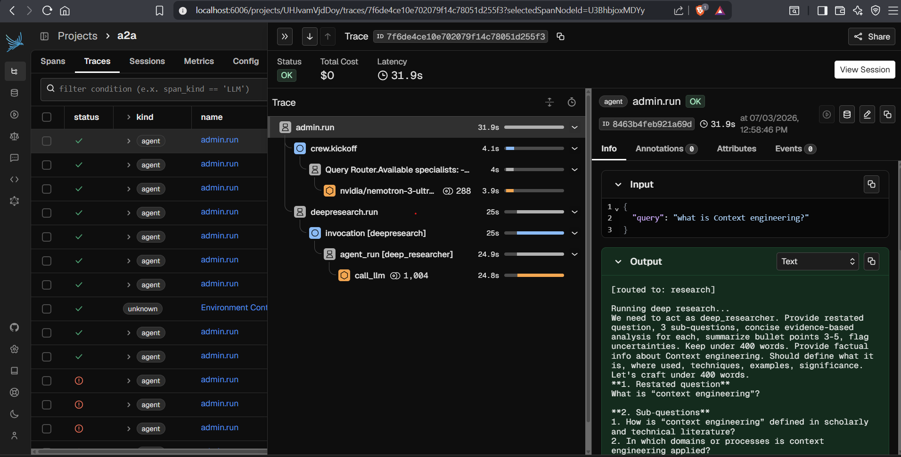
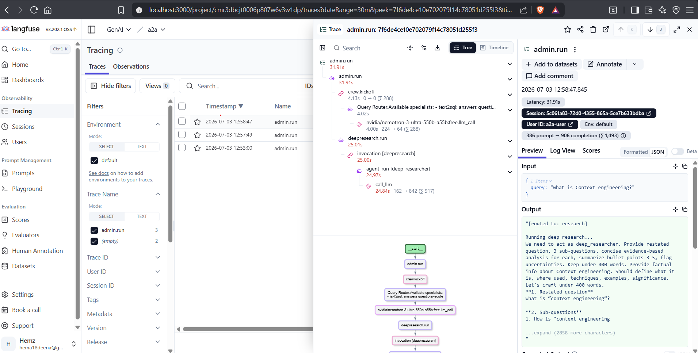

## Things worth knowing

A few non-obvious fixes ended up baked into the shipped code and `.env.example`
as a result of this run:

- **CrewAI drops LLM spans by default.** `CrewAIInstrumentor().instrument(...)`
  needs `use_event_listener=True` (set in `real_a2a/shared/observent_otel.py`)
  — without it, only `Crew`/`Task`/`Agent` spans show up, never an `llm` span
  with tokens/model/prompt-completion.
- **CrewAI's own telemetry pings clutter traces.** `CREWAI_DISABLE_TELEMETRY=true`
  (in `.env.example`) turns off CrewAI's anonymous "Crew Created"/"Task
  Created" usage pings, which otherwise piggyback onto the same
  `TracerProvider` and show up as noise next to real agent/LLM spans.
- **Google ADK's `llm.provider` is hardcoded to `"google"`** by
  `openinference-instrumentation-google-adk`, even when the model is routed
  through `LiteLlm` to a non-Google backend (this repo uses OpenRouter). The
  model name (`llm.model_name`) is still correct — only the provider
  attribution is wrong. No workaround shipped; just know a `deepresearch`
  span's provider label isn't trustworthy.
- **Langfuse's first boot is slow.** `docker compose ... up -d --wait` reports
  healthy well before `langfuse-web` actually accepts connections (no
  `healthcheck:` on that service upstream) — expect several minutes of
  polling before the UI responds.

Full spec/plan/task history for the shipped setup lives in `.observent/`.
